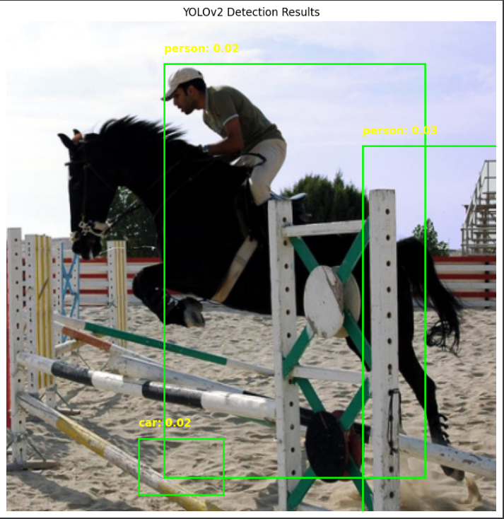

# YOLOv2 Object Detection (PyTorch)

Реализация и обучение модели **YOLOv2** на PyTorch для обнаружения объектов.

---

## 📌 О YOLOv2:

**YOLOv2** — это улучшенная версия архитектуры YOLO, которая вводит якорные боксы (anchor boxes), использует более глубокую сеть (Darknet-19) и демонстрирует отличное сочетание точности и скорости.

---

## 🚀 Скачать готовую модель:

[👉 Скачать YOLOv2 model.pth](https://drive.google.com/file/d/13aTLqwQZEL_ekz5ZrWmkBP-okQfpQtUk/view?usp=sharing)

После скачивания поместите файл в папку проекта.

---

## 📂 Структура проекта:

```
YOLOv2-PyTorch/
├── yolov2_model.pth (скачанная модель)
├── yolov2_model.py (код обучения модели)
├── test_yolov2.py (пример использования)
├── README.md
└── requirements.txt
```

---

## 🔨 Как использовать модель локально:

Установите зависимости:

```bash
pip install -r requirements.txt
```

Запустите пример с моделью YOLOv2:

```bash
python test_yolov2.py
```

---

## 🛠️ Зависимости:

- torch
- torchvision
- matplotlib

---

## 📸 Примеры работы модели:

<p align="center">
 
</p>

---

## 👨‍💻 Автор проекта:

- **Qosimi Kurush**
